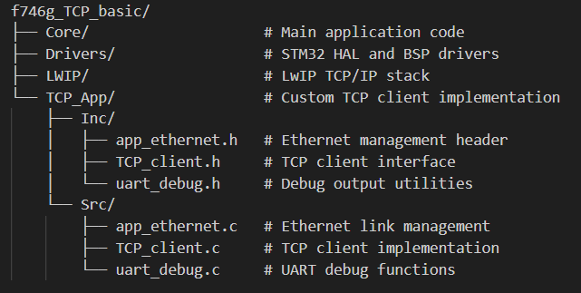

## Overview
- This project demonstrates TCP/IP communication using the STM32F746G Discovery board with LwIP stack. The client connects to a specified TCP server and continuously sends counter values in the format "counter:1", "counter:2", etc.

## Software
- STM32CubeMX - For project configuration
- STM32CubeIDE - For development and debugging
- Netcat - For TCP server

## Folder dir 

## Sample Output

